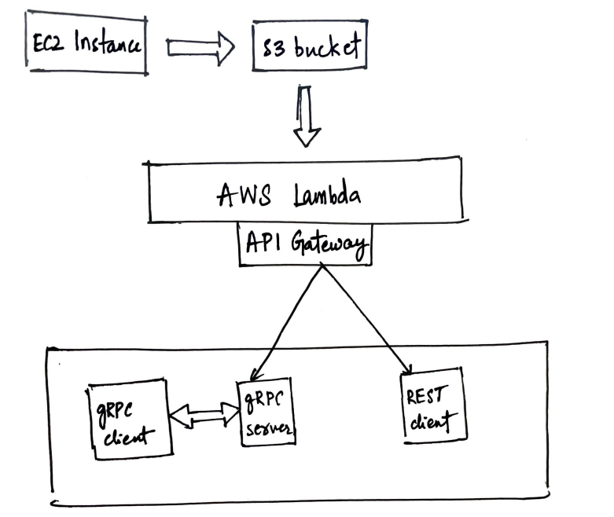
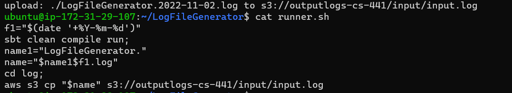
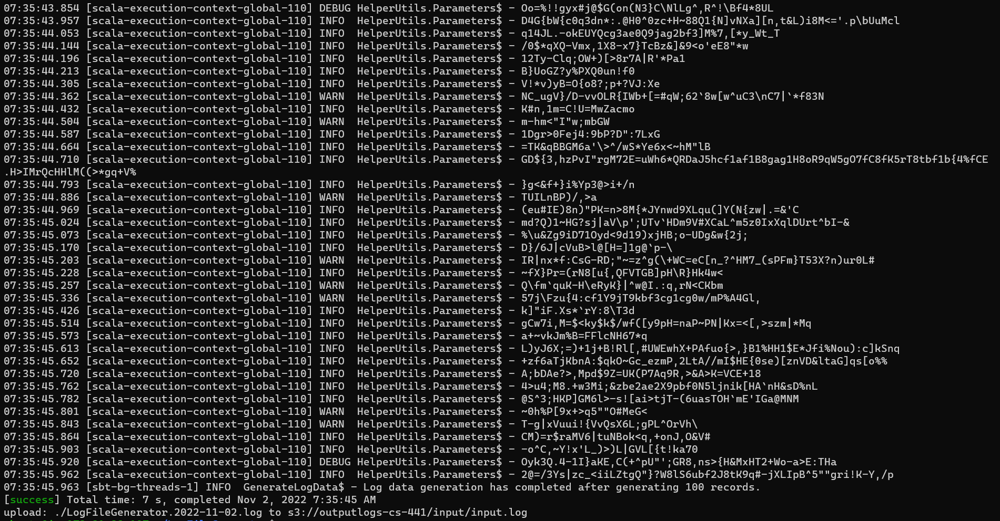
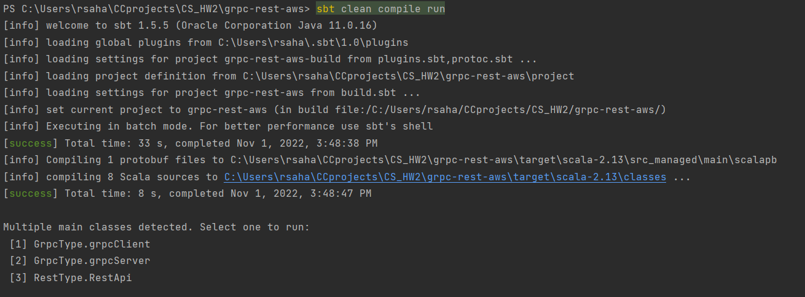
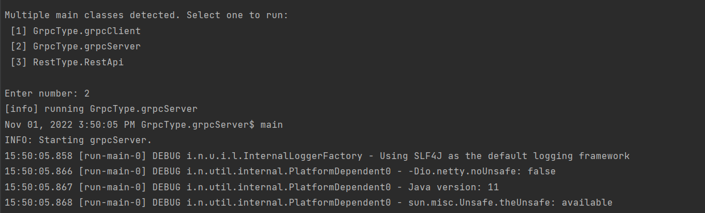
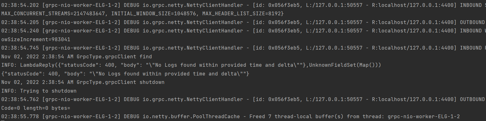
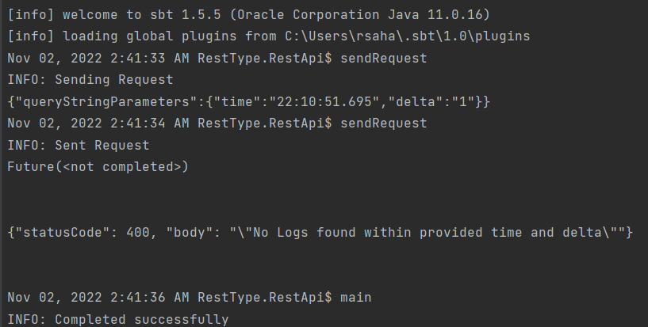
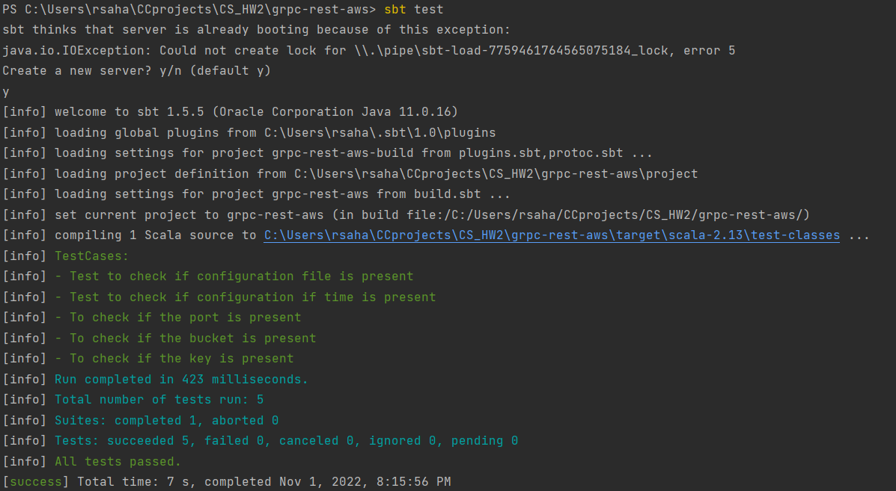

# grpc-rest-aws

Name: Sahaja Peddaveerannagari

### Project Assignment

The goal of this homework is for students to gain experience with solving a distributed computational problem using cloud computing technologies by designing and implementing a RESTful service and a lambda function that are accessed from clients using gRPC.

### Project Structure

1. Deploy LogFileGenerator in an EC2 instance, and then periodically update the log files in the S3 bucket.
2. To execute the operation of searching for log messages within a certain time frame, use an AWS Lambda function and invoking the Lambda Function using API Gateway's POST/GET method.
4. To trigger the AWS Lambda function using the gRPC framework, create a client-server model.

### Tasks
### Task-1: LogFileGenerator in EC2

### AWS Execution   
#### Setup

- Sign in to Amazon Web Services
#### AWS EC2 (Elastic Compute Cloud)
1. Create a EC2 instance
2. Click on launch instance  
3. Select "Ubuntu" and also download the key-pair created

#### IAM Role 
(Create IAM role for EC2 to give permission to access S3 bucket)
1. Navigate to AWS IAM
2. Click on Roles(left panel) - Create role - AWS service(Trusted entity type)- EC2 (Use case).
3. Search for "AmazonS3FullAccess" and create the role

#### Attach IAM role to the EC2 instance
1. Navigate to EC2 instance and click on Actions - Security - Modify IAM roles
2. Select the role you created above
3. Click on Save

#### Logging to the EC2 instance
1. Open the terminal in local setup
2. Write about 
3. Install Java, sbt, aws
4. Clone the git repository 
> git clone https://github.com/Sahajareddyp/CSH441HW2.git   

To run tests, use the command

>sbt clean compile test  

To build, run

>sbt clean compile assembly  

in the command line or

>clean compile assembly  

5. Create S3 bucket(Ex: cs441-hw2final).
6. Follow below commands to connect to EC2 and install scala, java and sbt:
   - ssh -i C:\Users\rsaha\Downloads\key.pem ubuntu@ec2-3-145-138-212.us-east-2.compute.amazonaws.com  
   - sudo apt-get update  
   - sudo apt-get -y install openjdk-8-jdk  
   - export JAVA_HOME=/usr/lib/jvm/java-8-openjdk  
   - echo "deb https://dl.bintray.com/sbt/debian /" | sudo tee -a /etc/apt/sources.list.d/sbt.list  
   - sudo apt-key adv --keyserver hkp://keyserver.ubuntu.com:80 --recv 2EE0EA64E40A89B84B2DF73499E82A75642AC823  
   - sudo apt-get update  
   - sudo apt-get install apt-transport-https curl gnupg -yqq  
   - echo "deb https://repo.scala-sbt.org/scalasbt/debian all main" | sudo tee /etc/apt/sources.list.d/sbt.list  
   - echo "deb https://repo.scala-sbt.org/scalasbt/debian /" | sudo tee /etc/apt/sources.list.d/sbt_old.list  
   - curl -sL "https://keyserver.ubuntu.com/pks/lookup?op=get&search=0x2EE0EA64E40A89B84B2DF73499E82A75642AC823" | sudo -H gpg --no-default-keyring --keyring gnupg-ring:/etc/apt/trusted.gpg.d/scalasbt-release.gpg --import  
   - sudo chmod 644 /etc/apt/trusted.gpg.d/scalasbt-release.gpg  
   - sudo apt-get update  
   - sudo apt-get install sbt  
   - curl "https://awscli.amazonaws.com/awscli-exe-linux-x86_64.zip" -o "awscliv2.zip"  
   - unzip awscliv2.zip  
   - sudo ./aws/install  
7. Copy over the project folder to EC2 instance in a new command line
   - scp -r -i C:\Users\rsaha\Downloads\key.pem C:\Users\rsaha\CCprojects\CS_HW2\LogFileGenerator.zip ubuntu@ec2-52-15-39-66.us-east-2.compute.amazonaws.com:~/  
8. Unzip the LogFileGenerator zip file.
9. Create a shell script that can run the log file as shown below.  

10. Run the shell script using bash which gives the below output.

#### Task-2 : To execute the operation of searching for log messages within a certain time frame, use an AWS Lambda function and invoking the Lambda Function using API Gateway's POST/GET method.
### Lambda 
- Lambda is a serverless service that can trigger can event. 

The program is written in Python.
1. It is taking time, delta & pattern as input and returns if the pattern is present in the time frame.
2. The response will be returned with appropriate status code.
3. The code is using binary search to locate the given time in the log file making the time complexity of code as O(log(n)).
4. Status codes:  
    a. 200- Pattern present
    b. 400- Pattern not present or time duration not present  in log file.

### AWS API Gateway
- API Gateway makes it easier to create and maintain APIs.

#### AWS Lambda - AWS API Gateway Setup

##### AWS Lambda setup
1. Navigate to AWS Lambda, create function and select Function.
2. Enter name, select Python as language, enter the code from logs_lambda.py.
3. Deploy.
4. Repeat the same process for logs_retrieve_lambda.py as well.

##### API Gateway Setup
1. Navigate to AWS Lambda, click on Add Trigger, select API Gateway and create an API with configuration. (API Type- REST, Security- Open)
2. Gateway is open to the internet and Lambda function can be triggered by HTTP POST/GET requests.
3. Whenever a GET/POST request is made to the created API gateway, Lambda function will be triggered taking the query parameters/payload as input.

##### Create IAM role and attach it to the Lambda
1. Navigate to AWS IAM - click on Roles(left panel)- Create Role(Lambda)- Search for "AmazonS3FullAccess" and Create Role.
2. Navigate to the Lambda - click on Configuration - Permissions - Execution role, click on Edit under Execution roles.
3. Select the role given in Step 1 above.

#### Postman
1. The requests (GET/POST) can also be made through Postman as it can be seen below with payload in following format.

2. Similarly, the GET request can also be made by passing the values through query parameters.

#### Task-3: HTTP requests using AKKA and Scala source

- To run the application, navigate to root directory and run "sbt clean compile run" to the project.

#### Grpc Server

The server will start running on localhost.

#### Grpc Client

After the server is started, you can send a RPC request to the running server and wait for the response.

#### RestApi

The request is made to AWS Lambda function with by passing values through query parameters.

### TestCases

Clone the Repository. In terminal, navigate to the repository and run the below command.

> sbt clean compile test

### YouTube Link

- YouTube link of the video that documents all steps of the deployment and execution : [YouTube Link](https://youtu.be/Md5WAIMmZfo)

### References

1. Dr. Grechanik, Mark, (2020) Cloud Computing: Theory and Practice.
2. [Apache Hadoop](https://hadoop.apache.org/)
3. [Grpc](https://scalapb.github.io/docs/grpc/)
4. [StackOverflow](https://stackoverflow.com/)
5. [AWS EMR](https://aws.amazon.com/education/awseducate/)
6. [EC2 Instance-S3 Bucket](https://aws.amazon.com/premiumsupport/knowledge-center/ec2-instance-access-s3-bucket/)
7. [API Gateway](https://docs.aws.amazon.com/apigateway/latest/developerguide/welcome.html)